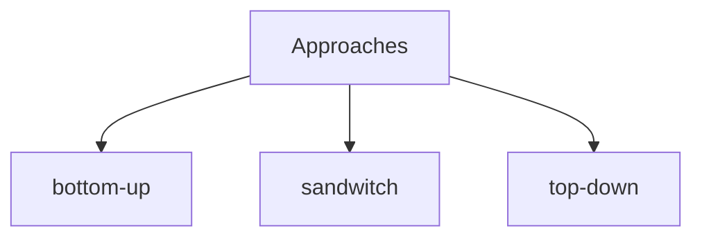

## Definition

Opposed to [[non-incremental (big-bang) unit testing]], is an iterative process included among the [[white-box testing]] techniques. A [[SUT (system under test)]] is tested progressively, a piece at the time, and the modules are connected incrementally.
- components are tested in a step-by-step fashion
- dependencies, input/output data may be handled by a [[driver]], or a [[stub]]

**Advantages**
- issues and bugs are easily detected, since the process is progressive
- it is a flexible approach, suitable for a large project 

> [!y] When to use this approach
> When the system is complex or highly modular, the team is distributed or when a continuous feedback is required to gradually improve a system

**Bottom-up approach**
Low-level entities (e.g., single functions) are first tested and then integrated with high-level components (e.g., classes, objects). There is no specific order to select which high-level entity should be integrated first. Hence, numerous sequences are possible

**Top-down approach**
High-level components are tested first. Low-level entities are integrated at a later time. Again, there is no specific order to respect.

**Sandwich approach**
A mixed approach is taken, combining bottom-up and top-down techniques.

![[bottom_up_top_down_testing_comparison.png]]

> [!warning]
> More time-consuming than an non-incremental approach. It depends on drivers and stubs

## References
[[05 Module (Unit) Testing]]