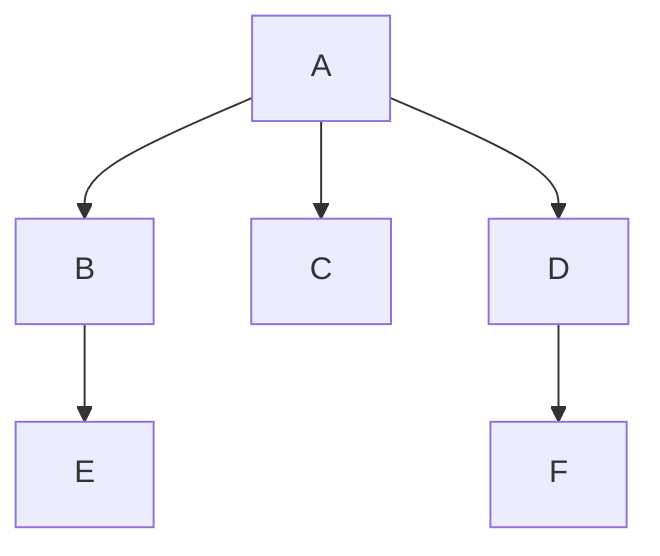

## Definition

Non-incremental testing, also known as big-bang testing, is a [[white-box testing]] approach where all components or modules of a system are integrated simultaneously, and the entire system is tested as a whole. Unlike [[incremental or integration testing]], which involves integrating and testing components or modules incrementally, non-incremental testing takes a ==more holistic approach to testing the entire system at once==.
### Example

Process:
1. a test is performed on each of the six modules, [[unit testing]] each module as a stand-alone entity. The modules might be tested at the same time or in succession
2. the modules are combined or integrated to form the program using [[driver]] or [[stub]] abstractions

## References
https://www.geeksforgeeks.org/introduction-to-non-incremental-testing/
[[05 Module (Unit) Testing]] (p.98)