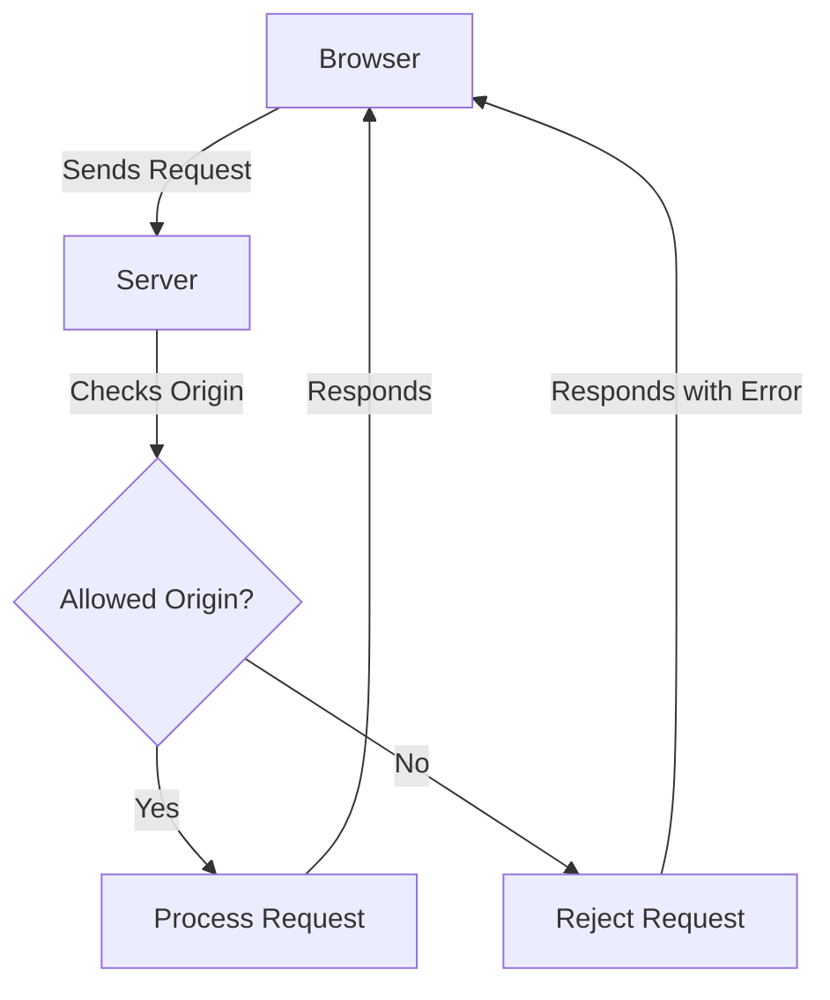

## Definition

Cross-Origin Resource Sharing (CORS) is an HTTP-header based mechanism that allows a server to indicate any origins ([[domain]], scheme, or [[port]]) other than its own, ==from which a browser should permit loading resources==. CORS a set of rules that control how web applications hosted on one domain can request resources from a different domain. It is one of the possible [[cross-domain policies]]

> They are necessary to enhance **security** by preventing potentially malicious behavior from web pages.



## Why CORS is Necessary

**Security**
Without CORS, any web page could make requests to any other domain without restriction, which could lead to security vulnerabilities such as data theft or unwanted actions on behalf of the user.

**Privacy**
CORS helps prevent unauthorized access to private information by ensuring that only trusted websites can access resources.

**Control**
It gives resource owners control over which external domains can interact with their server.

## Simple Example Scenarios

**Scenario 1: Simple Request Without CORS**
Imagine you have a web application running on https://example.com that needs to fetch data from an API hosted on https://api.anotherdomain.com.

Without CORS, a request like this might be blocked by the browser for security reasons.

**Scenario 2: Enabling CORS**
To enable CORS, the server at https://api.anotherdomain.com must include specific headers in its response. These headers tell the browser that the requesting domain (https://example.com) is allowed to access the resources.

A simple example of how CORS headers might be added to the server’s response:

```
Access-Control-Allow-Origin: https://example.com
Access-Control-Allow-Methods: GET, POST
Access-Control-Allow-Headers: Content-Type
```

**Access-Control-Allow-Origin**
Specifies which origins are allowed to access the resource. * can be used to allow all domains, though this is not recommended for sensitive data.

**Access-Control-Allow-Methods**
Specifies the HTTP methods that are allowed when accessing the resource.

**Access-Control-Allow-Headers**
Specifies which headers can be used during the actual request.

## Example of a CORS Request and Response

Client-Side JavaScript

```JavaScript
fetch('https://api.anotherdomain.com/data', {
  method: 'GET',
  headers: {
    'Content-Type': 'application/json'
  }
})
.then(response => response.json())
.then(data => console.log(data))
.catch(error => console.error('Error:', error));
```

Server-Side Response
On the server side (https://api.anotherdomain.com), the response would include CORS headers:

```
http
Copy code
HTTP/1.1 200 OK
Access-Control-Allow-Origin: https://example.com
Content-Type: application/json

{
  "data": "This is the response data"
}

```

---
## References
- https://developer.mozilla.org/en-US/docs/Web/HTTP/CORS
- [[(Zhu, 2021)]]