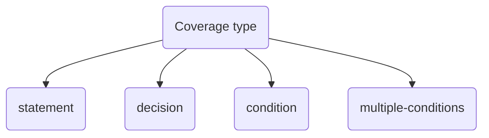

## Definition

Logic coverage aims at covering logic paths in a program. It is similar to [[unit testing]], but it does not necessary require a [[test oracle]] to be executed.



**Statement coverage**
The statement coverage is a [[white-box testing]] technique that ==aims to execute every statement in a program, at least once==.

In practice, this means to stress a function by passing every kind of input possible, in order to execute every statement it includes. The goal is to make every line of code covered. This is mostly useful to detect unreachable paths or statements that throw an [[error]].

Aiming at 100% coverage may seem relevant, but it is not actually a good way to testing your software:
- logical errors are not detected (e.g., the actual *condition* used in the function may be incomplete or week, or a path may be executed by mistake) 

```Python
if (x > 0):
    print(true)
print(false)

# With x = 1 all the statements are executed, but the case x <= 0 is not considered
```


**Decision or branch coverage**
Each decision/branch in statements such as *if, else, while, switch*, etc, must be traversed at least once. ==The focus is on executing each branch, not to test every possible condition that satisfies the statements==. Decision coverage usually can satisfy statement coverage.

```Python
if (x > 0 or y == 0):
    print(true)
else:
    print(false)

# In decision coverage, the focus is on the branch execution
# only x > 0 and x < 0 need to be executed to execute the different paths, while other valid conditions are ignored
```


**Condition coverage**
In condition coverage, the individual condition units are tested, regardless of the actual decision/branch. ==Each unit must be evaluated as true or false, at least once==.
Not all the possible combination are taken into consideration.
- An improved version is the **decision/condition coverage**, which focus both on the conditions and on the decision/path.

```Python
if (x || y): 
    print("Decision met")

# In condition coverage, the units of a condition are under test
# Each unit should be tested as true/false
# Therefore, not all the possible combination are tested, because
  # 1) x = true, y = false
  # 2) x = false, y = true
# are enough to satisfy the condition coverage
```

 
 **Multiple-condition coverage**
Each possible point of entry in a condition is tested, as well as each possible output. This is the most complete approach, but also the most computationally expensive. It is associated to [[combinatorial testing]].

```Python
if (x > 0 and y < 5):
    print("Condition met")

# All the possible input combinations are tested:
  # 1) x > 0 true, y < 5 true
  # 2) x > 0 true, y < 5 false
  # 3) x > 0 false, y < 5 true
  # 4) x > 0 false, y < 5 false
```

## References
[[04 Test-case Design]]