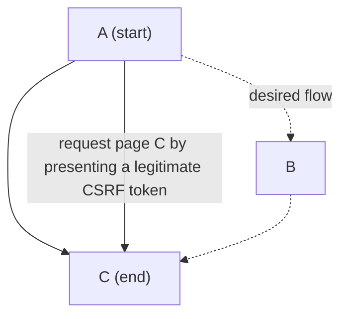

## Bypass via session variables

## Bypass via CSRF token

1. An attacker knows the intended flow of an application
2. A legitimate [[CSRF (cross-site request forgery) token]] is issued on visiting the first page (A), to protect against CSRF attacks
3. if the application ==relies solely on a  token without enforcing the sequence of visited pages==, an attacker might directly request page C after page A, bypassing page B.

## Risks

---
#### References
- [[(Deepa, Thilagam, et al., 2018)]]
- [[(Ben Jaballah, Kheir, et al., 2016)]]