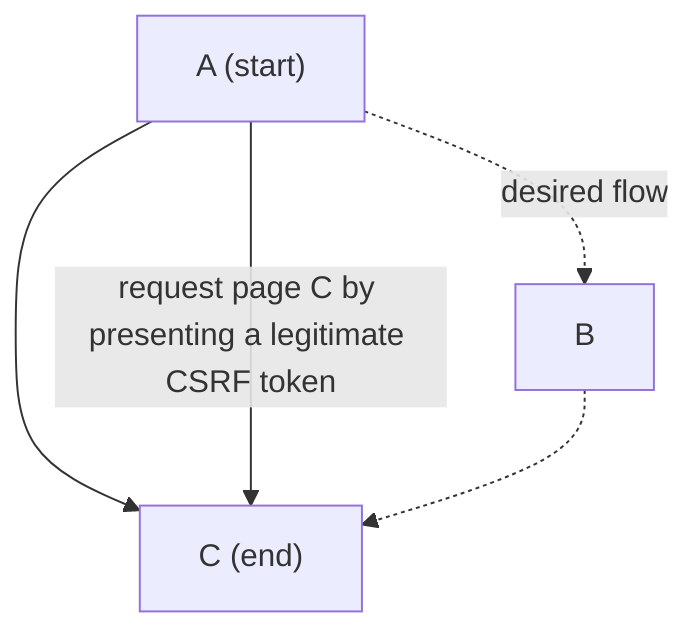

In the context of [[BFT (business flow tampering)]], a workflow bypass occurs when an attacker manages to ==skip or alter one or more mandatory steps in an intended process, thereby achieving unauthorized or malicious behavior==. It is one of the most subtle and dangerous forms of vulnerability, because it exploits weaknesses in the application logic rather than implementation bugs or classic technical vulnerabilities.

**Front-end software role in this context** 
- Storing of sensitive data (session cookie, tokens)
- If the front end is the only one to verify that the user has, for example, completed step A before moving on to C, then an attacker can tamper the front-end code to perform the bypass
- reverse engineering of the application flow (workflow discovery): JavaScript code (even if minified) reveals expected sequences, endpoint names and control mechanisms (e.g. variables like `stepCompleted = true`). This makes it easier to build targeted attacks.
## Bypass via CSRF token

1. An attacker knows the intended flow of an application
2. A legitimate [[CSRF (cross-site request forgery) token]] is issued on visiting the first page (A), to protect against CSRF attacks
3. if the application ==relies solely on a  token without enforcing the sequence of visited pages==, an attacker might directly request page C after page A, bypassing page B.

**Example**
An attacker manage to skip page B (e.g., confirmation of data in a financial transaction), making a payment processed directly without confirmation from the user

## Bypass via session variables

If the application uses session cookies (e.g. PHPSESSID, JSESSIONID) but does not keep track of the intermediate state of the session (e.g. that a user has completed stage 1 of a process), then an authenticated user can skip directly to the final stage

## Mutable URL or JSON parameters

If the user or action state is contained in client-side parameters (e.g. step=3), an attacker can simply modify the parameter and simulate an unauthorized step.

---
#### References
- [[(Deepa, Thilagam, et al., 2018)]]
- [[(Ben Jaballah, Kheir, et al., 2016)]]