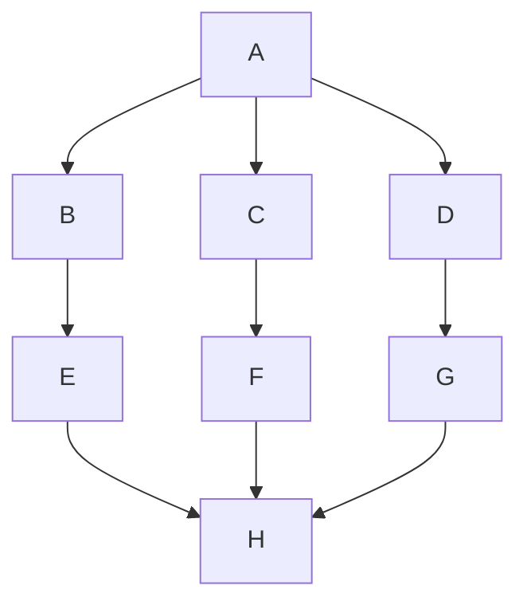

## Definition

Non-incremental testing, also known as big-bang testing, is a [[white-box testing]] approach where all components or modules of a system are integrated simultaneously (or tested in sequence and then combined), and the entire system is tested as a whole. Unlike [[incremental or integration testing]], which involves integrating and testing components or modules incrementally, non-incremental testing takes a ==more holistic approach to testing the entire system at once==.
- the single units of the system are ignored until they are all combined together

**Advantages**
- do not require a specific programmation or organization, since the whole system is studied as a whole
- useful to detect bugs that emerges *while combining different functions or classes*
- faster than an incremental approach

A test is performed on the whole system, providing an input to (A) and analyzing the output (H) against a [[test oracle]].

> [!warning]
> May be difficult to localize and identify the origin of an issue, since the whole system is targeted. The process is computationally expensive, especially if the system is a large scale application

## References
https://www.geeksforgeeks.org/introduction-to-non-incremental-testing/
[[05 Module (Unit) Testing]] (p.98)