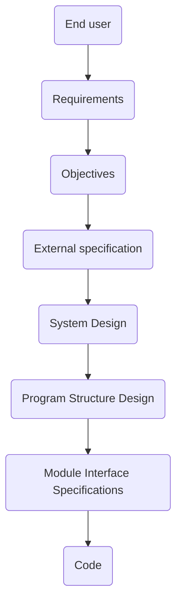

The software life cycle:

The ==testing cycle should be based on the development cycle==. In other words, you should be able to establish a one-to-one correspondence between development and testing processes. For instance:
- The purpose of a module test is to find discrepancies between the program’s modules and their interface specifications.
- The purpose of a function test is to show that a program does not match its external specifications.
- The purpose of a system test is to show that the product is inconsistent with its original objectives

**Function testing**
Function testing is a process of attempting to find discrepancies between the program and the external specification (e.g., a description of the program's behavior from the end user pov)

**System testing**
System testing aims at comparing the system to its original objectives. It is a more high-level process compared to the function testing. The focus is on issues related to the external specification (interfaces, guis). Examples:
- [[volume testing]] (what happen when the system is subject to heavy volumes of data?)
- [[stress testing]] (what happen when the system runs continuously for a long period of time?). ==Web applications are common subjects of stress testing (p.124)==
- [[usability testing]] (is the system easy to use and to learn? Compare to [[E2E (end-to-end) testing]])
- [[security testing]]: the process of attempting to devise test cases that subvert the program’s security checks

