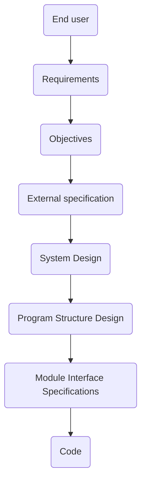

The software life cycle:

The ==testing cycle should be based on the development cycle==. In other words, you should be able to establish a one-to-one correspondence between development and testing processes. For instance:
- The purpose of a module test is to find discrepancies between the program’s modules and their interface specifications.
- The purpose of a function test is to show that a program does not match its external specifications.
- The purpose of a system test is to show that the product is inconsistent with its original objectives

**Function testing**
Function testing is a process of attempting to find discrepancies between the program and the external specification (e.g., a description of the program's behavior from the end user perspective)

**System testing**
System testing aims at comparing the system to its original objectives. It is a more high-level process compared to the function testing. The focus is on issues related to the external specification (interfaces, guis). Examples:
- [[volume testing]] (what happen when the system is subject to heavy volumes of data?)
- [[stress testing]] (what happen when the system runs continuously for a long period of time?). ==Web applications are common subjects of stress testing (p.124)==
- [[usability testing]] (is the system easy to use and to learn? Compare to [[E2E (end-to-end) testing]])
- [[security testing]]: the process of attempting to devise test cases that subvert the program’s security checks. Is the system safe? Control security holes in existing programs that provide services similar to the [[SUT (system under test)]]. ==Web applications often need a higher level of security testing than do most applications (p.125)==.
- [[performance testing]]: is the system performant enough?
- [[storage testing]]: is the amount of system memory enough?
- [[configuration testing]]: do the most common software configurations work as expected?
- [[compatibility or conversion testing]]: does the system keep the compatibility with previous software versions?
- [[installation testing]]: some systems have complicated installation procedures
- [[reliability testing]]: is the system reliable? What is the estimated uptime?
- [[recovery testing]]: how well the system recover from programming errors, hardware failures and data errors? The goal is to minimize the [[MTTR (Mean Time To Recover)]]
- [[serviceability or maintenance testing]]: how easy is to maintain the program? to implement a new feature? what the mean time to debug?
- [[procedure testing]]: a database administrator should document procedures for backing up and recovering the database system. If possible, a person not associated with the administration of the database should test the procedures
- [[regression testing]]: are the old functionalities still running smoothly?

**Acceptance testing**
[[acceptance testing]] is the process of comparing the program to its initial requirements and the current needs of its end users

**Test completion criteria**
When, exactly, we can stop testing a system? There is no way of knowing if the error just detected is the last one
- stop when time and resources are expired
- stop when a predefined arbitrary number of errors have been found (e.g., using industry-wise averages)
- ==plot the number of errors found per unit time== during the test phase and examining the shape of the curve